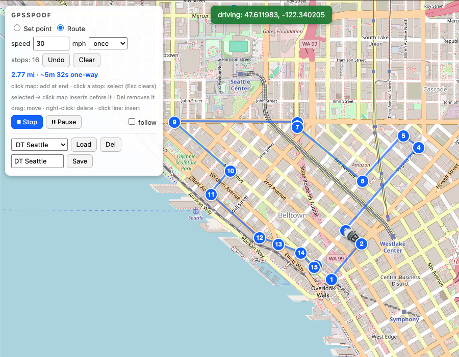

# gpsspoof

A small macOS tool that spoofs the GPS location of a USB-connected iPhone
using [`pymobiledevice3`](https://github.com/doronz88/pymobiledevice3).
Set a fixed point, **drive a route** through waypoints at a chosen speed
(once / loop / bounce), or open a **clickable browser map** to place and
drive routes live. An optional **realistic** mode drives like a human —
variable speed, real acceleration and braking, slowing for corners, and
drifting GPS jitter. Pure Python — the map UI is a small page served on
localhost, no native GUI. Targets iOS 17 and newer (verified on iOS 26).



*`gpsspoof map` — click to drop stops, then drive the route; the car
marker follows live and the panel shows distance and one-way time.*

```text
$ sudo gpsspoof set seattle
connected: My iPhone (iPhone18,2) iOS 26.4.2
udid:      00008030-0123456789ABCDEF
... scanning for RemoteXPC service (Bonjour, ~3s)...
... found RemoteXPC service in 3.1s
... establishing TCP tunnel...
... tunnel up at fd00:6:1:2:3:4:5:6:54321 (0.4s)
... connecting to RemoteServiceDiscovery...
... opening DVT channel...
... DVT channel ready (1.2s)

  SPOOFING ACTIVE  →  seattle  (47.6062, -122.3321)
  device           →  My iPhone
  pid              →  49823

  press Ctrl-C to clear and exit

^C
... received stop signal after 47.3s, clearing location...
... cleared. real GPS resumed.
```

**Use it for:** testing location-aware apps, geofencing, and navigation;
demos and QA; or simply moving the blue dot — including driving a
believable route — on a device you own.

> **Intended use.** Spoof only an iPhone you own and control. Faking your
> location to deceive online services, defeat anti-cheat, or commit fraud
> may violate their terms or the law. Use it responsibly and only where
> you're authorized.

---

## Contents

- [How it works](#how-it-works)
- [Phone setup](#phone-setup)
- [Install](#install)
- [Quick start](#quick-start)
- [Command reference](#command-reference)
  - [`gpsspoof ui`](#gpsspoof-ui)
  - [`gpsspoof map`](#gpsspoof-map)
  - [`gpsspoof list`](#gpsspoof-list)
  - [`gpsspoof set`](#gpsspoof-set-location--lat-lon)
  - [`gpsspoof route`](#gpsspoof-route-waypoints)
  - [`gpsspoof routes`](#gpsspoof-routes)
  - [`gpsspoof clear`](#gpsspoof-clear)
  - [`gpsspoof status`](#gpsspoof-status)
  - [`gpsspoof add`](#gpsspoof-add-name-lat-lon)
  - [`gpsspoof rm`](#gpsspoof-rm-name)
- [Locations file](#locations-file)
- [State file](#state-file)
- [Output, exit codes, and stderr/stdout split](#output-exit-codes-and-stderrstdout-split)
- [Why does it need sudo?](#why-does-it-need-sudo)
- [Skip sudo with tunneld](#skip-sudo-with-tunneld)
- [Troubleshooting](#troubleshooting)
- [Comparison with the official `pymobiledevice3` CLI](#comparison-with-the-official-pymobiledevice3-cli)
- [Multiple iPhones](#multiple-iphones)
- [Limitations](#limitations)
- [Requirements](#requirements)

## How it works

```
usbmux.list_devices()                   ─── find iPhones over USB
        │
        ├─ lockdown query                ─── model + iOS version (no root)
        │
        └─ get_core_device_tunnel_services()
                │                        ─── pause `remoted`,
                │                            Bonjour-scan for CoreDevice
                │                            tunnel service  (NEEDS ROOT)
                │
                └─ start_tunnel_over_core_device(protocol=TCP)
                        │                ─── bring up TCP tunnel
                        │
                        └─ RemoteServiceDiscoveryService
                                │
                                └─ DvtProvider
                                        │
                                        └─ LocationSimulation
                                                .set(lat, lon)
                                                .clear()
```

`LocationSimulation.set` issues the same DVT instrument call Xcode uses
(`simulateLocationWithLatitude:longitude:`). `.clear()` issues
`stopLocationSimulation`, restoring the real GPS feed.

The tool uses **TCP** for the tunnel because iOS 18.2 removed QUIC
support; TCP works for all iOS 17+ versions, so there's no version-gated
branching.

## Phone setup

One-time, on the iPhone:

1. Plug into the Mac with a **data**-capable USB cable (not a
   power-only cable). Tap "Trust This Computer" on the device.
2. Enable Developer Mode:
   `Settings → Privacy & Security → Developer Mode → On`. The phone
   reboots and asks you to confirm Developer Mode after the reboot —
   you have to confirm it again, otherwise the toggle reverts.
3. Make sure the phone is **unlocked** when running `sudo gpsspoof
   set …`. RemoteXPC services are only exposed while unlocked.

The developer disk image (DDI) is bundled with iOS 17+ and mounts
lazily on first developer-tool access. You don't usually need to mount
it manually — but if `gpsspoof set` errors with "no RemoteXPC tunnel
service found", that's the most likely cause.

## Install

```bash
git clone https://github.com/lpasqualis/gpsspoof.git
cd gpsspoof
python3 -m venv .venv
.venv/bin/pip install -e .
```

The editable install puts a `gpsspoof` script at `.venv/bin/gpsspoof`.

To make plain `gpsspoof` and `sudo gpsspoof` both work without
typing the venv path, drop two symlinks:

```bash
# user-writable, on your normal PATH
ln -sf "$PWD/.venv/bin/gpsspoof" /opt/homebrew/bin/gpsspoof

# in macOS sudo's default secure_path, so `sudo gpsspoof` works
sudo ln -sf "$PWD/.venv/bin/gpsspoof" /usr/local/bin/gpsspoof
```

Verify:

```bash
gpsspoof --help
sudo gpsspoof --help
```

> Why two symlinks? `/opt/homebrew/bin` is on your interactive PATH but
> isn't in macOS's compiled-in `secure_path`, so `sudo` won't find a
> binary there. `/usr/local/bin` is in `secure_path` but isn't user
> writable. One symlink in each gives you both ergonomics without
> editing `sudoers`.

### Alternative: `pipx`

If you prefer pipx, `pipx install .` works for the unprivileged
commands but `sudo gpsspoof` still won't resolve unless you also
symlink the pipx entry into `/usr/local/bin` as above.

## Quick start

```bash
gpsspoof ui                       # interactive menu (recommended)
gpsspoof map                      # click-on-a-map browser UI

gpsspoof                          # no args ⇒ prints help
gpsspoof list                     # list named locations
gpsspoof set seattle              # one-shot foreground spoof; Ctrl-C clears
gpsspoof set 47.490308 -122.205647   # spoof to raw coordinates
gpsspoof route kent seattle redmond --speed 30   # drive a route at 30 mph
gpsspoof route kent seattle redmond --realistic  # human-like motion + GPS jitter
gpsspoof status                   # show what's running (from any shell)
gpsspoof clear                    # explicitly clear the device

gpsspoof add airport 47.4502 -122.3088   # add or update a location
gpsspoof rm airport                      # remove one
```

> `ui`, `map`, `set`, `route`, `clear` need either `sudo` **or** a running tunneld
> daemon (set up once — see [Skip sudo with tunneld](#skip-sudo-with-tunneld)).
> The tool auto-detects tunneld; if it isn't running, prefix the
> command with `sudo`.

## Command reference

### `gpsspoof ui`

Interactive mode. **Needs root or a running tunneld.** Pick a location from a numbered
menu, watch the tunnel come up, see a live elapsed-time counter while
the device is being spoofed, then press any key to clear and pick a
different location. `q` (or empty input) at the menu exits cleanly;
Ctrl-C at any point clears the device and quits the whole UI.

```text
────────────────────────────────────────────────────────────
  gpsspoof  interactive mode
  device:  My iPhone (iPhone18,2) iOS 26.4.2
  udid:    00008030-0123456789ABCDEF
────────────────────────────────────────────────────────────

Select a location:
  [ 1]  bellevue   47.6101, -122.2015
  [ 2]  issaquah   47.5301, -122.0326
  [ 3]  kent       47.3809, -122.2348
  ...
  [12]  vegas      36.1699, -115.1398
  [ q]  quit
  ...or a coordinate pair: 47.490308, -122.205647
  ...or a route to drive: kent > seattle > redmond @ 30 [loop|bounce] [natural]

> 1
→ engaging: bellevue (47.6101, -122.2015)
... scanning for RemoteXPC service (Bonjour, ~3s)...
... tunnel up at fd00:6:1:2:3:4:5:6:54321 (0.4s)
... DVT channel ready (1.2s)

  ┌─ SPOOFING ACTIVE
  │  bellevue  (47.6101, -122.2015)
  │  My iPhone  [00008030-0123456789ABCDEF]
  │
  └─ press any key to clear and return to menu  (Ctrl-C to quit)
  elapsed: 0:00:42
[user presses space]
  clearing...
  cleared, real GPS resumed

Select a location:
...
```

`ui` is the simplest way to flip between locations rapidly: each
selection re-establishes the tunnel, sets the location, and tears it
down on key press. The tunnel/DVT setup runs once per selection, so
expect the same 5–20 s warm-up each time.

Besides the numbered entries, you can type at the `>` prompt:

- a raw coordinate pair (e.g. `47.490308, -122.205647`) to spoof an
  arbitrary point that isn't in the list; or
- a route to drive — waypoints separated by `>` (or `->`) with an
  optional trailing `@ speed` in mph, an optional `loop` or `bounce`
  keyword, and an optional `natural` keyword for realistic motion, e.g.
  `kent > seattle > redmond @ 30`,
  `kent > seattle > redmond @ 30 bounce`, or
  `47.5,-122.2 > 47.49,-122.2 @ 25 loop natural`. Each waypoint may be a
  name or a `lat,lon` pair. A single pass waits at the final waypoint for a
  keypress; `loop`/`bounce` run until Ctrl-C (Ctrl-C while moving quits the
  UI). `natural` adds the human-like motion + GPS jitter described under
  [`route --realistic`](#gpsspoof-route-waypoints).

### `gpsspoof map`

Open a **clickable map in your browser** to set the location *and* build
and drive routes. **Needs root or a running tunneld.** It connects to the
iPhone, starts a small local web server on `127.0.0.1` (a random free
port), opens your default browser to it, and holds until you press
Ctrl-C (which clears the spoof and restores real GPS).

```bash
gpsspoof map
```

```text
connected: My iPhone (iPhone18,2) iOS 26.5.1
udid:      00008030-0123456789ABCDEF
... borrowed tunnel from tunneld in 0.2s (no root needed in this process)

  map ready  ->  http://127.0.0.1:51847/
  device     ->  My iPhone [00008030-0123456789ABCDEF]
  click to set a point, or switch to Route mode to build and Drive a route; Ctrl-C to clear and exit

... set 47.490308, -122.205647
... driving 3 stops @ 30 mph (loop)
^C
... shutting down map server, clearing location...
... cleared. real GPS resumed.
```

The page has a small control panel with two modes:

- **Set point** (default): click anywhere to teleport the device there;
  drag the marker to fine-tune.
- **Route**: build a path of numbered stops, then drive it. Set a
  **speed** (mph) and a repeat mode (**once / loop / bounce**, same
  meanings as [`gpsspoof route`](#gpsspoof-route-waypoints)), then press
  **▶ Drive**; the position marker (a white car) follows the device live,
  pointing in the direction of travel. The same
  button becomes **⏹ Stop** while running (press to end and hold). **⏸
  Pause** freezes the dot in place and becomes **▶ Resume** to continue.
  The panel shows the route's **length** (miles) and the
  **one-way time** at the current speed, updating as you edit stops or
  change the speed. Changing the speed **while a drive is running** takes
  effect immediately — no need to stop and restart. Tick **follow** to
  keep the map centered on the dot as it drives (toggle off to pan freely).
  Tick **natural motion** before pressing Drive for the human-like profile
  described under [`route --realistic`](#gpsspoof-route-waypoints) — variable
  speed, real acceleration/braking, slowing for corners, and drifting GPS
  jitter; leave it off for exact, constant-speed movement. Ticking it reveals
  four knobs (the **speed** field stays the cruise target):
    - **vary ±__%** — how far the cruise speed wanders above/below the target;
    - **accel __ g** / **brake __ g** — the acceleration and braking limits;
    - **jitter __–__ m** — the GPS scatter range (its low–high bounds; the
      radius drifts within them, standing in for a varying accuracy).

  While a natural drive runs, a live readout under the route info shows the
  **current speed** (mph) and **current acceleration** in **g** (positive
  speeding up, negative braking) — so you can watch it ramp, hold, slow for a
  corner, and roll to a stop. These knobs are a map-only convenience; the CLI's
  `--realistic` uses the built-in defaults.

  Editing the stops:

  - **click the map** — add a stop at the end;
  - **click a stop** — select it (highlighted orange; click again or
    press <kbd>Esc</kbd> to deselect);
  - with a stop selected, **click the map** — insert the new stop
    *before* the selected one (so selecting #5 and clicking makes the new
    stop #5 and the rest shift down); this is how you add a stop before
    #1;
  - **click a line** — insert a stop at that point in the middle;
  - **drag a stop** — move it; **right-click** a stop, or select it and
    press <kbd>Delete</kbd>/<kbd>Backspace</kbd> — remove it;
  - **Undo** / **Clear** — drop the last stop / empty the route.

  Saved routes (shared with the CLI's
  [`routes`](#gpsspoof-routes) / `route --load`): type a name and
  **Save** to store the current stops/speed/mode; pick one from the
  dropdown and **Load** to bring it onto the map (or **Del** to remove
  it). Saving with an existing name overwrites it, so you can load, edit,
  and re-save.

A status pill shows the current state ("real GPS", "spoofing: …", or
"driving: …"). Starting a route or clicking a new point supersedes
whatever was running; Ctrl-C in the terminal clears everything.

The map uses [Leaflet](https://leafletjs.com/) with OpenStreetMap tiles,
so it needs an internet connection to load the map (the tiles and the
Leaflet library are fetched from public CDNs). No API key is required.
The server binds to localhost only and is not reachable from other
machines. If a browser doesn't open automatically, open the printed URL
yourself.

### `gpsspoof list`

Print all named locations from `~/.config/iphone-spoof/locations.json`,
sorted alphabetically. Auto-creates the file on first run with 12
default locations (see [Locations file](#locations-file)).

```text
  bellevue     47.6101,  -122.2015
  issaquah     47.5301,  -122.0326
  kent         47.3809,  -122.2348
  ...
```

### `gpsspoof set LOCATION | LAT LON`

Start spoofing the connected iPhone's GPS to a location.
**Needs root or a running tunneld.** The process stays foregrounded until you press
Ctrl-C; on exit (clean, Ctrl-C, or any exception) it sends a clear
command so the real GPS feed resumes immediately.

The target is either a name from `locations.json` (case-sensitive) **or**
a raw coordinate pair. Coordinates may be given as two arguments or as a
single comma-separated string, so you can paste straight from Apple Maps
or Google Maps. Latitude must be in `[-90, 90]`, longitude in
`[-180, 180]`:

```bash
sudo gpsspoof set seattle                       # named location
sudo gpsspoof set 47.490308 -122.205647         # two arguments
sudo gpsspoof set "47.490308, -122.205647"      # one pasted string
sudo gpsspoof --udid 00008030-0123456789ABCDEF set tacoma
```

When you pass coordinates, the coordinate string itself is used as the
display name in `state.json` and `gpsspoof status` (nothing is added to
`locations.json` — use `gpsspoof add` for that).

While it runs, `~/.config/iphone-spoof/state.json` records the active
session so `gpsspoof status` from any other shell can describe it.

### `gpsspoof route WAYPOINTS`

Simulate **movement**: travel in straight-line segments through two or
more waypoints at a chosen speed, instead of standing at one point.
**Needs root or a running tunneld.** The device's position is interpolated
along the line between consecutive waypoints, so Apple Maps shows the blue
dot gliding along the route. The update rate adapts to the speed — about
once a second at city speeds, tightening at high speeds to keep each step
near 100 ft (capped at ~10 updates/second so it never floods the device).

Each waypoint is either a name from `locations.json` or a single
`lat,lon` token (one shell argument — comma-separate the pair, no space,
or quote it). You can mix the two freely:

```bash
sudo gpsspoof route kent seattle redmond --speed 30
sudo gpsspoof route 47.504993,-122.233256 47.491833,-122.233326 47.484829,-122.198335 --speed 30
sudo gpsspoof route kent "47.49, -122.20" redmond --speed 25
```

`--speed` is a bare number in **miles per hour** by default; add a unit
suffix to change that (`30mph`, `48km/h`, `13m/s`). Default is 30 mph.

**What happens at the end of the route** depends on the repeat mode:

| Mode | Flag | Path |
|------|------|------|
| once (default) | *(none)* | A → B → C → D → E, then **hold** at E until Ctrl-C |
| loop | `--loop` | A → B → C → D → E → A → B → … (drives the closing E → A leg, a full lap) repeated until Ctrl-C |
| bounce | `--bounce` | A → B → C → D → E → D → C → B → A → B → … (reverses at each end) repeated until Ctrl-C |

`--loop` and `--bounce` are mutually exclusive. In every mode, Ctrl-C
clears the device and restores real GPS.

```bash
sudo gpsspoof route kent seattle redmond --speed 45 --loop     # laps
sudo gpsspoof route kent seattle redmond --speed 45 --bounce   # there and back
```

```text
  route:  kent -> seattle -> redmond
  speed:  30.0 mph
  length: 14.62 mi  (~1764s per pass)

  press Ctrl-C to clear and exit

  seg 2/2 -> redmond  47.64012, -122.17683   71.3%  30 mph  ETA 507s
```

Notes:

- Movement is interpolated as a straight line between waypoints (a
  rhumb-style path in lat/lon), not snapped to roads.
- A waypoint token that *starts* with `-` (a southern- or
  western-hemisphere point like `-33.8688,151.2093`) is otherwise
  mistaken for an option flag; put `--` before the waypoint list:
  `sudo gpsspoof route --speed 50 -- -33.8688,151.2093 -37.8136,144.9631`.
- `gpsspoof status` reports the route as its `start -> ... -> end` label.

**Realistic motion (`--realistic`).** By default a route is driven exactly:
the dot holds the commanded speed and tracks the straight segments precisely.
Add `--realistic` (alias `--natural`) to make it drive like a human instead:

- **Variable speed.** The commanded speed becomes a *cruise target* that
  drifts within a band (about ±8%), so it never sits perfectly flat.
- **Real acceleration and braking.** Speed changes are rate-limited (it
  pulls away from a stop and slows down gradually, with some variation in
  how hard), rather than snapping to the new value.
- **Slowing for corners.** It looks ahead and brakes before a turn — gently
  for a slight bend, hard for a hairpin — then accelerates back out. A single
  pass also rolls to a stop on arrival; `loop`/`bounce` keep rolling.
- **GPS jitter.** The reported fix carries a small, slowly-drifting scatter
  (a few meters, wandering as if the accuracy were changing), so the dot
  wobbles like a real one — even while stopped.

```bash
sudo gpsspoof route kent seattle redmond --speed 35 --realistic
sudo gpsspoof route kent seattle redmond --speed 35 --realistic --loop
```

About **GPS accuracy**: the device protocol only accepts a latitude and
longitude — iOS generates the `horizontalAccuracy` value apps read, and there
is no way to set it. So the accuracy *number* can't be spoofed, but the
jitter above reproduces its *effect* (the dot scattering more or less over
time). As a bonus, iOS derives the reported speed and heading from successive
fixes, so the acceleration and cornering make those readings look natural too.
Realistic mode is a per-drive choice and is not stored with saved routes.

**Saving and reusing routes.** A route (its stops, speed, and repeat
mode) can be saved by name to `~/.config/iphone-spoof/routes.json` and
replayed later — from the CLI or from the [`map`](#gpsspoof-map) page,
which read and write the same file:

```bash
sudo gpsspoof route kent seattle redmond --speed 30 --save commute  # save, then drive
sudo gpsspoof route --load commute                                  # drive the saved route
sudo gpsspoof route --load commute --bounce --speed 45              # override mode/speed on load
gpsspoof route --delete commute                                     # delete (no device needed)
gpsspoof routes                                                     # list saved routes
```

`--save` stores the route before driving; `--load` replays it (any
`--speed` / `--loop` / `--bounce` / `--realistic` you also pass override what
was saved). See [`gpsspoof routes`](#gpsspoof-routes) to list them.

### `gpsspoof routes`

List the saved routes from `~/.config/iphone-spoof/routes.json` (created
on first save). Runs unprivileged.

```text
  commute  2 stops, 30 mph, loop
  scenic   5 stops, 25 mph, bounce
```

Save routes with `gpsspoof route ... --save NAME` or from the
[`map`](#gpsspoof-map) page; delete them with
`gpsspoof route --delete NAME` or the map's **Del** button.

### `gpsspoof clear`

Send a clear-location command to the device, restoring real GPS.
**Needs root or a running tunneld.** Useful when a previous `set` was killed without
being able to clean up (e.g. `kill -9`, terminal closed without
Ctrl-C, crash). Safe to run when nothing is spoofed.

If `state.json` records a UDID, `clear` targets that device by default
even if multiple iPhones are connected.

### `gpsspoof status`

Show the currently active spoof session, if any:

```text
spoofing:
  device:   My iPhone [00008030-0123456789ABCDEF]
  location: seattle (47.6062, -122.3321)
  pid:      49823
```

If `state.json` exists but the recorded PID is gone, prints a "stale
state" warning suggesting `sudo gpsspoof clear`. If neither, prints
`no active spoof`.

Runs unprivileged.

### `gpsspoof add NAME LAT LON`

Add or update a location. Latitude must be in `[-90, 90]`, longitude
in `[-180, 180]`. Existing names are silently overwritten:

```bash
gpsspoof add liberty 40.6892 -74.0445
```

Prints `added` or `updated` so you can tell which happened.

### `gpsspoof rm NAME`

Remove a location. Errors if `NAME` isn't present.

### `gpsspoof --udid UDID …`

Disambiguate when multiple iPhones are plugged in. Applies to `set`,
`route`, `map`, `clear`, and `status`. Without it, those commands refuse
to guess and print all UDIDs.

## Locations file

Path: `~/.config/iphone-spoof/locations.json`

Schema (a single JSON object whose keys are location names):

```json
{
  "<name>": { "lat": <float>, "lon": <float> },
  ...
}
```

The first read auto-creates the file with these defaults:

I-5 corridor, **south → north** (Portland OR up to Bellingham WA):

| name        | place               | lat       | lon         |
|-------------|---------------------|----------:|------------:|
| portland    | Portland, OR        |  45.5152  | -122.6784   |
| vancouver   | Vancouver, WA       |  45.6387  | -122.6615   |
| olympia     | Olympia, WA         |  47.0379  | -122.9007   |
| tacoma      | Tacoma, WA          |  47.2529  | -122.4443   |
| federal-way | Federal Way, WA     |  47.3223  | -122.3126   |
| kent        | Kent, WA            |  47.3809  | -122.2348   |
| renton      | Renton, WA          |  47.4829  | -122.2171   |
| issaquah    | Issaquah, WA        |  47.5301  | -122.0326   |
| seattle     | Seattle, WA         |  47.6062  | -122.3321   |
| bellevue    | Bellevue, WA        |  47.6101  | -122.2015   |
| redmond     | Redmond, WA         |  47.6740  | -122.1215   |
| everett     | Everett, WA         |  47.9790  | -122.2021   |
| marysville  | Marysville, WA      |  48.0517  | -122.1771   |
| bellingham  | Bellingham, WA      |  48.7519  | -122.4787   |

Other US:

| name      | place               | lat       | lon         |
|-----------|---------------------|----------:|------------:|
| vegas     | Las Vegas, NV       |  36.1699  | -115.1398   |
| la        | Los Angeles, CA     |  34.0522  | -118.2437   |
| lax       | LAX airport         |  33.9416  | -118.4085   |
| nyc       | New York, NY        |  40.7128  |  -74.0060   |

You can hand-edit the file (it's just JSON) or use `gpsspoof add` /
`gpsspoof rm`.

> Sudo and `~`: under `sudo`, `~` would normally resolve to `/root`.
> `gpsspoof` reads `SUDO_USER`'s home instead, so the same
> `locations.json` is used whether or not the command is prefixed
> with `sudo`.

## State file

Path: `~/.config/iphone-spoof/state.json`

Created by `gpsspoof set` on success, removed on clean exit. Contents:

```json
{
  "udid": "00008030-0123456789ABCDEF",
  "device_name": "My iPhone",
  "name": "seattle",
  "lat": 47.6062,
  "lon": -122.3321,
  "pid": 49823
}
```

Read-only as far as the tool is concerned — it's there so a separate
`gpsspoof status` invocation (potentially from another shell) can
describe the running session and check that the PID is alive.

If `set` is killed in a way that prevents cleanup (`kill -9`, power
loss, machine sleep), the file persists. `gpsspoof status` detects
this with a `os.kill(pid, 0)` liveness check and shows a stale-state
warning. The device may still hold the simulated fix in that case;
`sudo gpsspoof clear` resets it.

## Output, exit codes, and stderr/stdout split

`gpsspoof` separates progress chatter from results:

- **stdout** — durable output: list rows, status lines, the
  `SPOOFING ACTIVE` block, `cleared 'X'`, `added 'X'`, etc.
- **stderr** — transient stage updates: lines starting with `... `
  (the Bonjour scan, tunnel timing, DVT handshake), the
  auto-creation notice for `locations.json`, and warnings.

Pipe-friendly:

```bash
gpsspoof list 2>/dev/null | awk '{print $1}'
```

Exit codes:

| code | meaning                                              |
|------|------------------------------------------------------|
| 0    | success                                              |
| 1    | most failures (printed to stderr via `sys.exit(msg)`) |
| 2    | argparse usage error                                 |
| 130  | interrupted (`Ctrl-C` during `set` / `clear`)        |

## Why does it need sudo?

iOS 17 redesigned the developer-tools protocol to use RemoteXPC. To
reach those services from a Mac, two privileged things have to happen:

1. **Pause `remoted`.** macOS's own `remoted` daemon would otherwise
   intercept the Bonjour records advertising the on-device CoreDevice
   tunnel service. `pymobiledevice3` sends `SIGSTOP` to it during the
   scan and `SIGCONT` afterwards. Signaling system daemons requires
   root.
2. **Open the TCP tunnel.** The tunnel binds and connects in the
   protected network namespace. (iOS 18.2+ removed QUIC; TCP is the
   only protocol that still works.)

Everything after the tunnel is up — the actual `set` / `clear` DVT
calls — could in principle run unprivileged. There are two ways to
satisfy steps 1 and 2:

- **`sudo gpsspoof …`** — `gpsspoof` does both steps itself. Simple,
  no extra moving parts, but you `sudo` every time. (NOPASSWD sudoers
  rule eliminates the password prompt — see the install section.)
- **Run a `tunneld` daemon as root** — a long-lived process owns
  the privilege, exposes a localhost API, and `gpsspoof` borrows a
  ready-made tunnel from it without ever needing root itself. See
  [Skip sudo with tunneld](#skip-sudo-with-tunneld).

`gpsspoof` auto-detects tunneld at `127.0.0.1:49151` and prefers it
when available, falling back to the in-process path otherwise. You
can install tunneld at any time and the existing commands just start
working without `sudo`.

`list`, `status`, `add`, `rm` need none of this — they only touch
`~/.config/iphone-spoof/` and (for `status`) usbmux info via
usbmuxd's user socket.

The state file and locations file are owned by your user (the tool
explicitly resolves `SUDO_USER`'s home), so a `sudo gpsspoof set …`
run leaves files you can read and edit afterwards without sudo.

## Skip sudo with tunneld

`pymobiledevice3` ships with a `tunneld` daemon that holds the
privileged plumbing (the `remoted` pause + the TCP tunnel) and
exposes a localhost HTTP API (`127.0.0.1:49151`). Once it's running,
unprivileged clients — including `gpsspoof` — can borrow a tunnel
without elevating themselves.

### What you gain

- `gpsspoof set seattle`, `gpsspoof clear`, `gpsspoof ui` all run
  without `sudo`.
- The tunnel is kept warm between calls, so the 5–20 s setup cost
  collapses to ~0 s after the first connect.

### What it costs

- One always-running process (~25 MB resident, idle most of the time).
- Initial setup needs `sudo` once.
- Tunneld occasionally needs a restart after long sleep/wake cycles.

### Install

Run the bundled script from the repo root. It auto-detects the
`pymobiledevice3` binary (preferring `.venv/bin/`, falling back to
`$PATH`), writes the launchd plist, and bootstraps the daemon:

```bash
./scripts/install-tunneld.sh
```

You'll be prompted for your password once (the script needs root to
write into `/Library/LaunchDaemons/` and load the daemon). It's
idempotent — re-running just replaces the existing installation.

When it finishes, plain `gpsspoof set seattle` (no `sudo`) should
work and the first stage line will read:

```
... borrowed tunnel from tunneld in 0.0s (no root needed in this process)
```

The script accepts environment overrides if you need them:

| var                  | default                                        |
|----------------------|------------------------------------------------|
| `GPSSPOOF_PMD3`      | auto-detected (`.venv/bin/` then `$PATH`)      |
| `GPSSPOOF_LABEL`     | `com.gpsspoof.tunneld`                          |
| `GPSSPOOF_PLIST_DIR` | `/Library/LaunchDaemons`                        |
| `GPSSPOOF_LOG`       | `/var/log/<label>.log`                          |

### Uninstall

```bash
./scripts/uninstall-tunneld.sh
```

Stops the daemon and removes the plist. Safe to run when nothing is
installed. `gpsspoof` automatically falls back to the in-process
tunnel after tunneld goes away, so removing it is non-destructive.

### Troubleshooting tunneld

- **`gpsspoof` still says "needs root"** — tunneld isn't reachable.
  Check `nc -z 127.0.0.1 49151`, then `tail /var/log/gpsspoof-tunneld.log`.
- **tunneld is up but `gpsspoof` falls back to in-process** — tunneld
  hasn't paired the device yet. Plug the phone in, unlock it, wait a
  few seconds for tunneld to discover it.
- **Stops working after wake from sleep** — known: `remoted`
  occasionally lands in a stuck state. Restart tunneld:
  `sudo launchctl kickstart -k system/com.gpsspoof.tunneld`.

## Troubleshooting

### `no iPhone connected over USB`

- Unlock the phone.
- Re-tap "Trust This Computer" if it's been a while.
- Try a different cable. USB-A → Lightning power-only cables are
  common and look identical to data cables. Same for some cheap USB-C
  cables.
- Check `system_profiler SPUSBDataType | grep -A 3 -i iphone` — if
  macOS itself doesn't see the phone, no software fix will help.

### `RemoteXPC tunnel setup needs root on macOS`

Prefix the command with `sudo`. If you installed via the two-symlink
recipe in [Install](#install), `sudo gpsspoof set seattle` works
directly. Otherwise: `sudo $(which gpsspoof) set seattle`.

### `no RemoteXPC tunnel service found`

In rough order of likelihood:

1. Developer Mode is off (`Settings → Privacy & Security → Developer
   Mode`). Toggle on, reboot, **and** confirm again after the reboot.
2. Phone is locked. Unlock and retry.
3. Developer disk image hasn't mounted. Plug in, unlock, open Xcode
   once (or run `pymobiledevice3 mounter auto-mount`), then retry.
4. First scan after device reboot can take longer than the 3 s
   Bonjour timeout — retry the command.

### `sudo: gpsspoof: command not found`

`sudo`'s `secure_path` excludes `/opt/homebrew/bin`. Either install
the second symlink (see [Install](#install)) or run with
`sudo $(which gpsspoof) …`.

### `iOS 18.2+ removed QUIC protocol support`

Shouldn't appear with this tool — we already use TCP. If you're
seeing it, you're probably running the official `pymobiledevice3`
command directly with default options; pass `--protocol tcp`.

### Phone keeps the spoofed location after Ctrl-C

The Ctrl-C path explicitly calls `LocationSimulation.clear()`. If you
killed the process with `kill -9`, force-quit the terminal, or the
machine slept, that cleanup didn't run. Fix:

```bash
sudo gpsspoof clear
```

### Stage line "scanning for RemoteXPC service" hangs > 30 s

Bonjour scan is using a 3 s timeout. If you're stuck *much* longer,
the next step (TCP tunnel) is the culprit. Try:

```bash
sudo /Users/you/path/to/.venv/bin/python -m pymobiledevice3 remote browse
```

If that hangs too, restart `remoted` (kill `remoted` with `sudo
killall -9 remoted` and let launchd restart it) and retry. Often
`remoted` ends up in a bad state after sleep/wake cycles.

### Apple Maps blue dot didn't move

- Confirm `gpsspoof set` actually printed `SPOOFING ACTIVE` (not just
  the early stage lines).
- Open Apple Maps (not Google Maps or third-party apps — many cache
  location for several minutes). The dot should jump within a second.
- If Maps still shows your real position, force-quit and reopen Maps.

## Comparison with the official `pymobiledevice3` CLI

`gpsspoof` is a thin wrapper for one specific workflow. The same
underlying calls are exposed by the upstream CLI; here's the mapping
in case you need to drop down a level:

| `gpsspoof`                       | `pymobiledevice3` equivalent (with tunneld running)                 |
|----------------------------------|--------------------------------------------------------------------|
| `sudo gpsspoof set NAME`         | `pymobiledevice3 developer dvt simulate-location set --tunnel '' -- LAT LON` |
| `sudo gpsspoof clear`            | `pymobiledevice3 developer dvt simulate-location clear --tunnel ''` |
| (built-in tunnel setup)          | `sudo pymobiledevice3 remote tunneld` (separate, persistent)        |
| (no equivalent — it's local)     | `pymobiledevice3 lockdown info`                                     |

The big behavioral differences:

- `gpsspoof set` brings up the tunnel itself per-invocation, so there
  is **no** persistent `tunneld` daemon to manage.
- Locations are looked up by name from a local JSON file; the upstream
  CLI takes raw `lat lon` arguments.
- `gpsspoof` registers signal handlers that explicitly clear on exit.

If `gpsspoof` ever fails in a way that points at upstream tunneling,
the upstream CLI is the lowest-friction fallback for diagnosing.

## Multiple iPhones

Plug in two iPhones and run `gpsspoof set sf`:

```text
multiple iPhones connected; specify --udid:
  00008030-0123456789ABCDEF  My iPhone  (iPhone18,2, iOS 26.4.2)
  00008140-001234567890ABCD  Lab phone (iPhone16,1, iOS 18.4)
```

Pass `--udid` (top-level flag, before the subcommand):

```bash
sudo gpsspoof --udid 00008030-0123456789ABCDEF set seattle
```

Note: a single device often shows up twice in raw `usbmuxd` output —
once over `USB`, once over `Network` (when Wi-Fi sync is on).
`gpsspoof` filters to USB only and dedupes on UDID, so each physical
device appears exactly once.

## Limitations

- **macOS only.** The tunnel setup uses `utun` and `SIGSTOP` of
  `remoted`, both Darwin-specific.
- **Straight-line movement, not road-snapped.** `route` and the map
  drive the point in straight segments between waypoints — there's no
  routing engine, and no GPX file import (the underlying
  `LocationSimulation.play_gpx_file()` exists but isn't exposed).
- **No native altitude / course; speed is emulated.** Apple's DVT API
  only takes lat/lon, so "speed" is faked by stepping the point over
  time. There's no altitude or heading.
- **Ctrl-C clear is best-effort.** If the device is already
  disconnected when you Ctrl-C, the clear call fails and you'll see
  `warning: clear failed: …`. Reconnect and run `sudo gpsspoof clear`.

## Requirements

- macOS (Apple Silicon or Intel)
- Python 3.10+
- `pymobiledevice3 >= 9.0`
- iPhone running iOS 17 or newer with Developer Mode enabled

## License

MIT — see [LICENSE](LICENSE).
